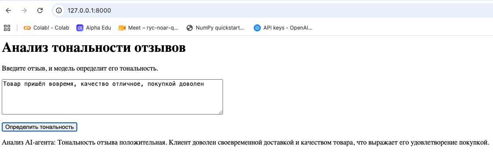

# Анализ тональности отзывов

## Описание проекта

Проект предназначен для определения тональности русскоязычных отзывов о товарах.

Модель классифицирует отзывы на три класса:
- positive — положительный
- neutral — нейтральный
- negative — отрицательный

## Данные

Для проекта использован датасет отзывов о товарах Wildberries.

На основе рейтинга товара была сформирована целевая переменная sentiment с тремя классами тональности.

## Анализ данных

В ходе работы был проведён исследовательский анализ данных (EDA):
- изучена структура датасета;
- проверены пропущенные значения;
- исследовано распределение рейтингов и классов тональности;
- проведена визуализация данных.

## Модели

Для классификации отзывов были протестированы:

- Logistic Regression + TF-IDF
- LinearSVC + TF-IDF
- готовая Transformer-модель

Модели сравнивались по Accuracy, Macro F1 и Weighted F1.

В качестве итоговой модели выбрана Logistic Regression с TF-IDF.

## AI-агент

В проект добавлен AI-агент для анализа отзывов.

Агент использует обученную ML-модель для определения тональности отзыва, а LLM — для формирования краткого объяснения результата.

Также реализован анализ группы отзывов, который позволяет:
- выделять основные жалобы клиентов;
- находить положительные моменты;
- формировать рекомендации по улучшению бизнеса.

## Интерфейс

Для демонстрации работы модели создан веб-интерфейс на FastAPI.

Пользователь вводит текст отзыва, после чего модель определяет его тональность.

## Запуск проекта

Установка зависимостей:

pip install -r requirements.txt

Для работы AI-агента необходимо задать переменную окружения OPENAI_API_KEY

Запуск приложения:

python -m uvicorn app:app --reload

После запуска приложение доступно по адресу:

http://127.0.0.1:8000

## Пример работы

